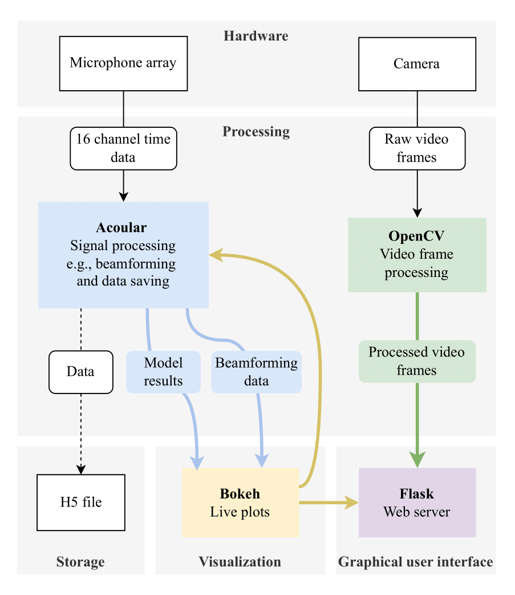

# SoundMap

Packages the application from [rabeaifeanyi/acoustic-camera](https://github.com/rabeaifeanyi/acoustic-camera/tree/876dedd0a637ad95d6036c2009b354188241ae7e). SoundMap adds command dispatch, verification documentation and a correction to the offline evaluation coordinate frame. Acoular-derived portions retain their separate BSD-3-Clause notices.

**Microphone-array measurements into sound-source maps.**

The application combines Acoular beamforming with a Bokeh dashboard and optional Flask camera overlay. Offline evaluation kernels use a shared x-mirrored coordinate frame, separate from the camera overlay frame.

## Set up

The original full application targets Python 3.11. Create an isolated environment before installing its pinned dependencies.

```bash
python -m pip install -r requirements.txt
python soundmap.py --help
# Requires the configured microphone array:
python soundmap.py run --no-flask
```

The command delegates to the existing application from its required working directory. A `.keras` model may be supplied with `--model`; the model route requires separate weights and TensorFlow. See the [original setup guide](docs/REFERENCE.md).

## Processing layout



This remains a research/test application with the original implementation's limitations. A real microphone array, device configuration, optional camera, and any chosen model are needed for live use. No microphone, camera, or device-capture route was started during packaging.

## Verification

See [the verification record](docs/VERIFICATION.md) for dated checks and unavailable hardware/model checks. It distinguishes the original packaging parity check from the later synthetic evaluation-coordinate acceptance check.

## Source and license scope

[Source and notices](THIRD_PARTY_NOTICES.md) identifies the original application and Acoular-derived file. [LICENSE](LICENSE) covers new and authorized contributions; it does not establish a grant for the remaining inherited application. The pinned original application has no project license file or README grant, and separate redistribution permission has not been verified.

Maintained by [nazeeh111](https://github.com/nazeeh111).
